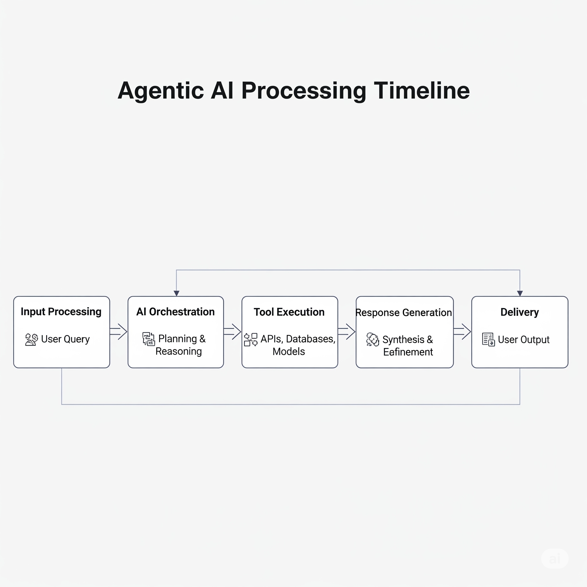

# Agentic AI Medical Consulting

This project is an agentic AI-powered medical consulting platform. It features a backend for agent logic and a frontend for user interaction.

## Features
- Agent-based medical consulting logic
- Modern frontend interface
- Modular backend and frontend code

## Project Structure
- `backend/` — Agent logic, tools, and utilities
- `frontend/` — UI, API, and state management
- `assets/` — Project images and diagrams

## Visual Overview

### High-Level System Architecture

### Agent Execution Timeline

### Detailed Agent Decision Flow

### Gemini Generated Image

## Getting Started
1. Clone the repository
2. Install dependencies: `pip install -r requirements.txt`
3. Run the backend and frontend as per your setup

---

*For more details, see the code in the `backend/` and `frontend/` folders.*
