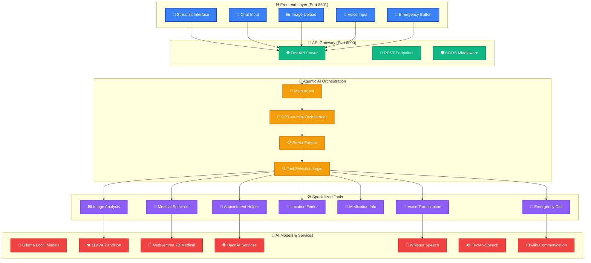
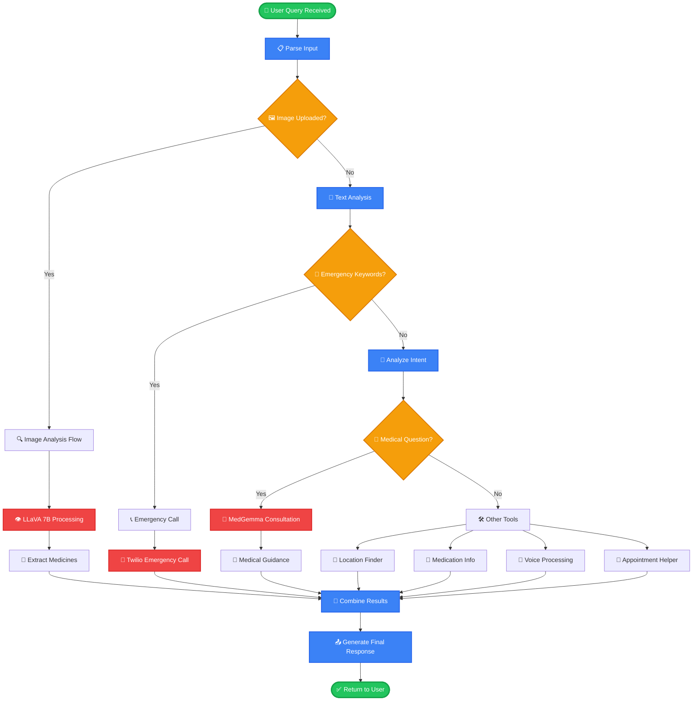
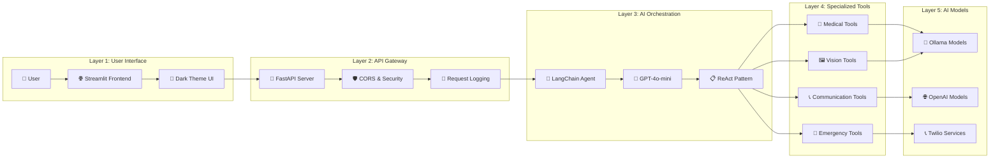

# 🏥 Agentic AI Medical Consulting - Visual Flow Diagrams

## 🎯 **High-Level System Architecture (Mermaid)**

## 🔄 **Detailed Agent Decision Flow**

## 🏗️ **System Architecture Layers**

## 📊 **Tool Selection Matrix**

| User Input Type | Primary Tool | Secondary Tool | AI Model Used |
|----------------|--------------|----------------|---------------|
| 🖼️ **Image Upload** | `analyze_medical_image` | `ask_medical_specialist` | LLaVA 7B + MedGemma 7B |
| 🚨 **Emergency Keywords** | `emergency_call_tool` | `find_nearby_specialists` | Twilio API |
| 🏥 **Medical Questions** | `ask_medical_specialist` | - | MedGemma 7B |
| 📍 **Location Queries** | `find_nearby_specialists_by_location` | - | Google Maps API |
| 💊 **Medication Info** | `get_medication_information` | `ask_medical_specialist` | Drug Database + MedGemma |
| 🎤 **Voice Input** | `transcribe_voice_message` | `ask_medical_specialist` | Whisper + MedGemma |
| 📅 **Appointments** | `schedule_appointment_helper` | `find_nearby_specialists` | GPT-4o-mini |

## 🔍 **Agent Execution Timeline**

```mermaid
gantt
    title Agentic AI Processing Timeline
    dateFormat X
    axisFormat %s
    
    section Input Processing
    Parse Request     :0, 1
    Image Processing  :1, 3
    
    section AI Orchestration
    GPT-4o Decision   :3, 5
    Tool Selection    :5, 6
    
    section Tool Execution
    Model Inference   :6, 15
    Result Processing :15, 17
    
    section Response Generation
    Combine Results   :17, 19
    Format Response   :19, 20
    
    section Delivery
    Return to User    :20, 21
```

This comprehensive flow diagram shows exactly how your agentic AI medical consulting system processes user queries through intelligent tool selection and multiple AI models to provide comprehensive medical assistance!
